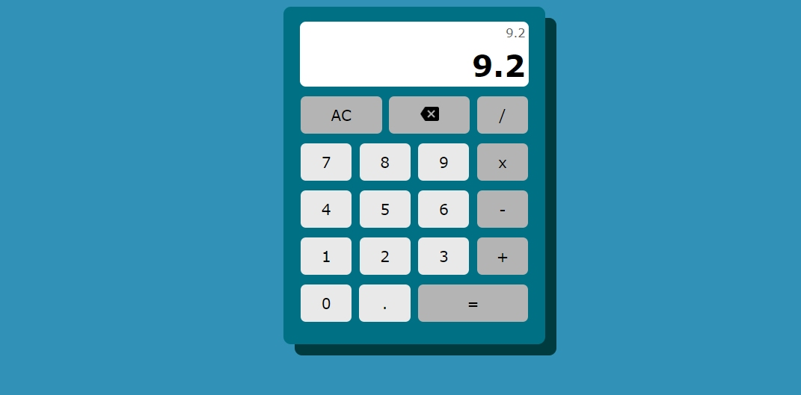

# Calculadora HMTL/CSS/JS

Esta é uma calculadora simples para treino de HTML e CSS que usa como lógica a função eval() do JS.
Apesar de simples, possui as seguintes implementações:

- Não permite a repetição errada dos operadores e da pontuação.
- Possui também função try/catch para capturar possíveis erros.
- Impõe limite de valor digitado.
- Substitui o último operador digitado sem necessidade de apagar.

Outro projeto mais robusto será implementado assim que possível.

